# Project 2 documentation

`sudo apt update`

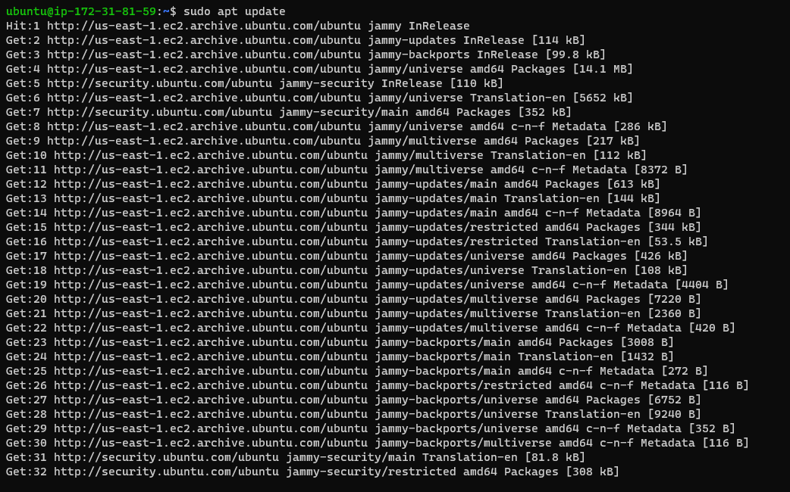

`sudo apt install nginx`

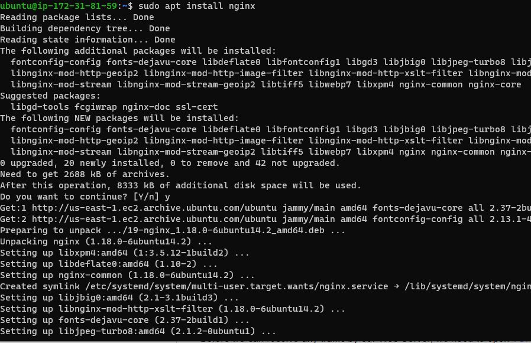

`sudo systemctl status nginx`

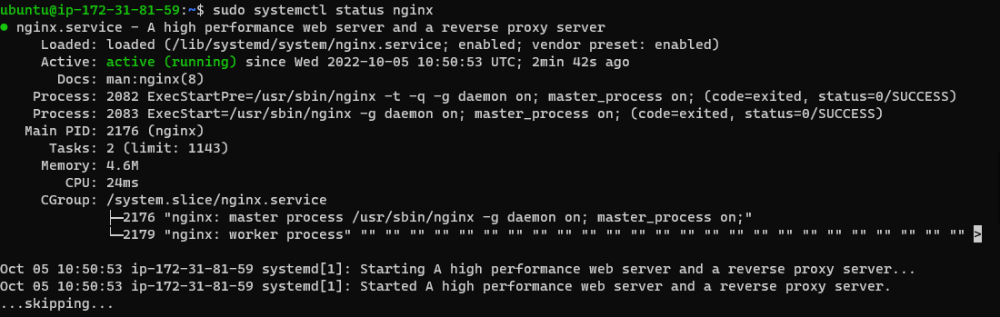

`curl http://localhost:80`

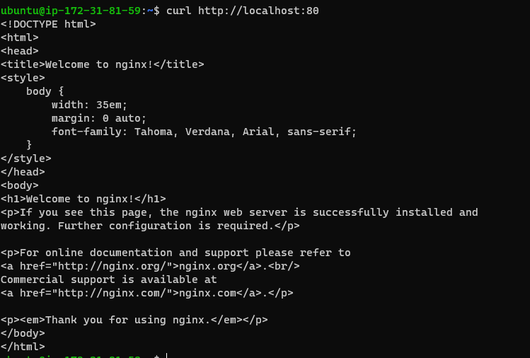

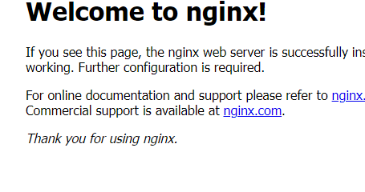

`sudo apt install mysql-server`

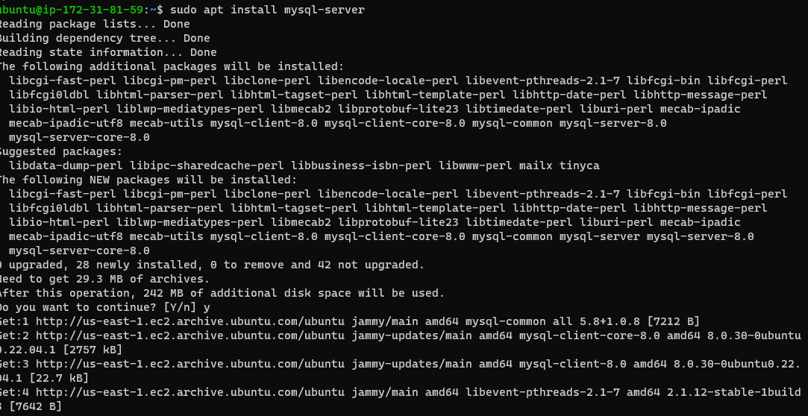

## Installing PHP and Interpreter

`sudo apt install php-fpm php-mysql`

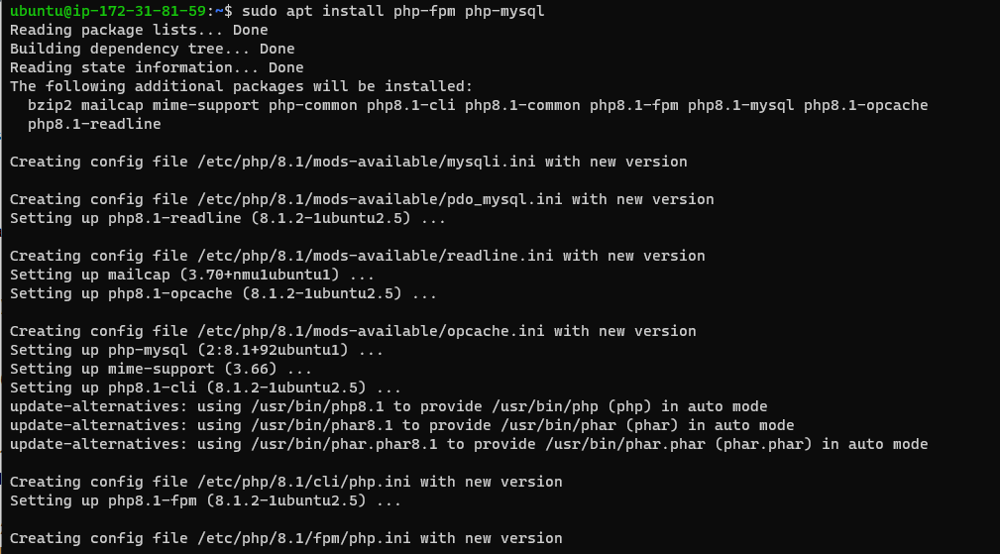

### Activating Configurations

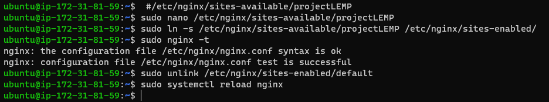

`sudo echo 'Hello LEMP from hostname' $(curl -s http://169.254.169.254/latest/meta-data/public-hostname) 'with public IP' $(curl -s http://169.254.169.254/latest/meta-data/public-ipv4) > /var/www/projectLEMP/index.html`

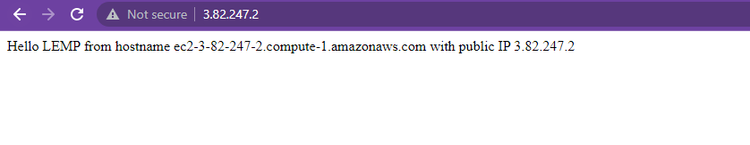

`sudo nano /var/www/projectLEMP/info.php`

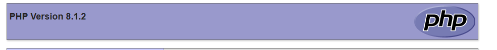

### Creating database and user

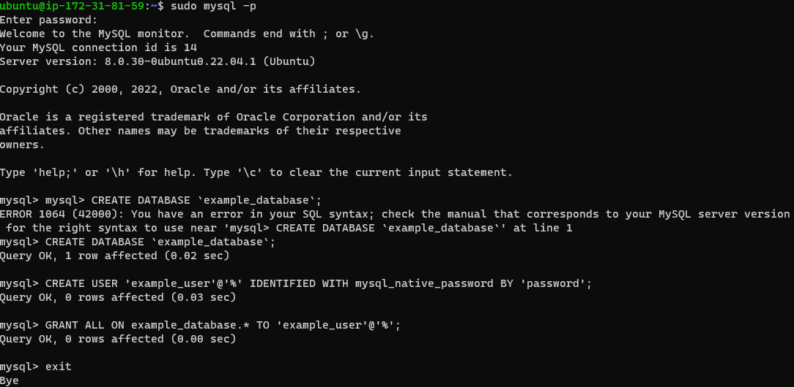

`INSERT INTO example_database.todo_list (content) VALUES ("My first important item"),`

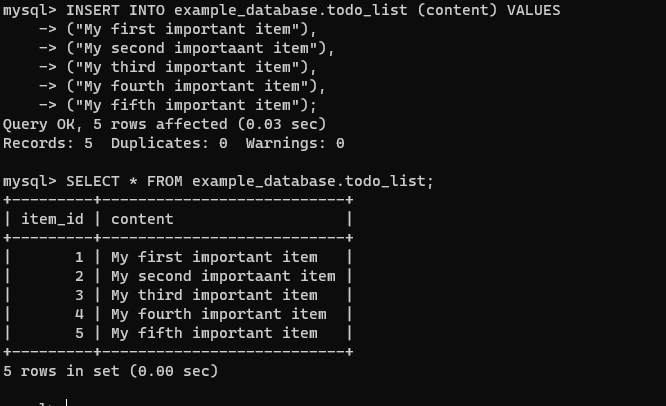

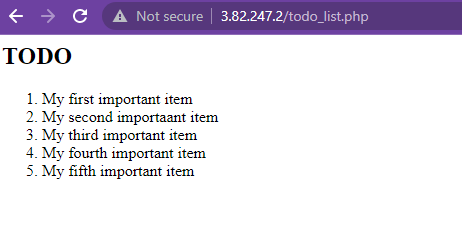
